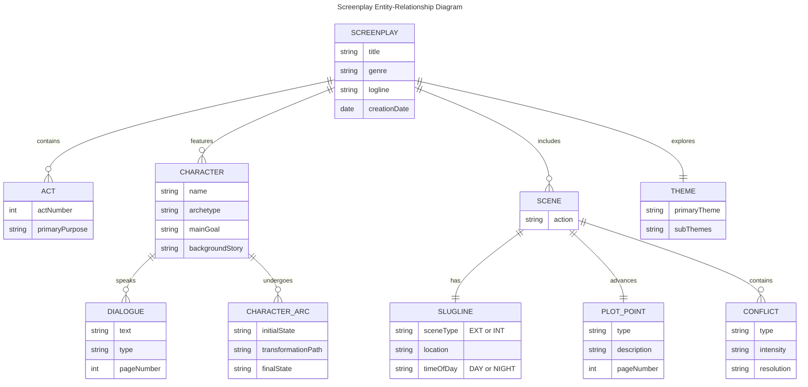

# 100 - Entity-Relationship Diagram of a Screenplay

I'll create an Entity-Relationship Diagram for screenplay elements based on general screenwriting knowledge, being careful not to directly reproduce copyrighted material from any specific source.

Let me explain the Entity-Relationship Diagram I've created:

The diagram captures the key structural and narrative elements of a screenplay, showing how different components interact:

1. **Screenplay** is the central entity, which:
   - Contains multiple Acts
   - Features Characters
   - Includes Scenes
   - Explores a Theme

2. **Characters** are linked to:
   - Dialogues they speak
   - Their character arc (transformation)

3. **Scenes** are connected to:
   - Plot Points they advance
   - Conflicts they contain

The relationships show how these elements are interconnected, representing the complex structure of a screenplay. Each entity has key attributes that define its characteristics:
- Screenplay has title, genre, logline
- Characters have name, archetype, main goal
- Scenes have slugline, setting, action
- Plot Points have type and page number
- Conflicts have type and intensity

This diagram provides a comprehensive view of how different screenplay elements relate to each other, capturing the narrative structure from a systemic perspective.

I'll update the ERD to explicitly break down the slugline into its components.

I've made the following key changes:

1. Created a new **SLUGLINE** entity with specific attributes:
   - `sceneType`: Represents EXT (Exterior) or INT (Interior)
   - `location`: The specific location of the scene
   - `timeOfDay`: Represents DAY or NIGHT

2. Established a one-to-one relationship between SCENE and SLUGLINE, reflecting that each scene has exactly one slugline.

This update more precisely captures the standard screenplay slugline format, which provides crucial information about the scene's setting at a glance. The slugline is a critical element in screenwriting, quickly communicating to the reader (and potential production team) the basic environmental context of the scene.

